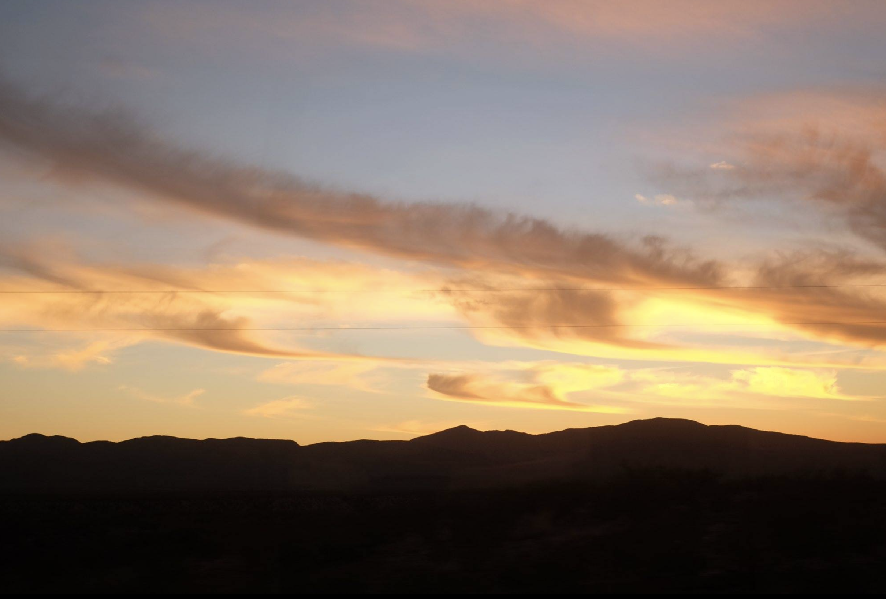
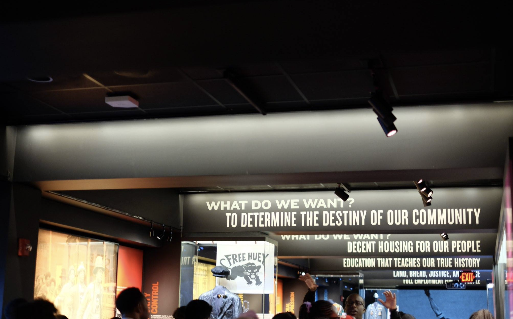
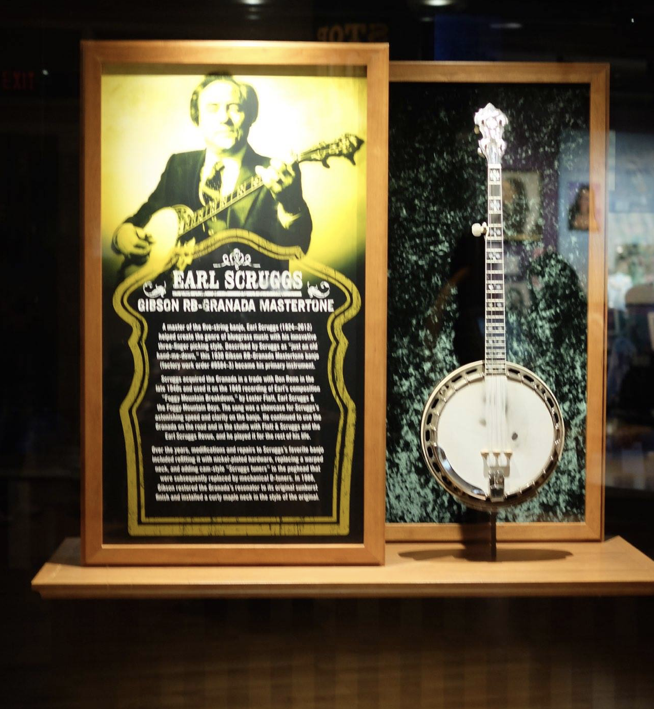

---

title: early december
type: "journal"
date: "2020-12-08"
featured_image: "./images/featured_image.jpg"
image_description: "amtrak"
published: true

---

every December, I think about my most desperate December of all, the one that I spent mostly looking out of train windows as we passed winter fields and other paint-like landscape studies, rehashing the same heartbreak story I told myself over over over over, convincing myself there had to be something more than myself. three weeks was what it took to look at myself in the mirror through the reflection of America, she’s the strange witness to my high and low moments.

 

three weeks was all it took. 

time felt grander when there was nowhere to be except anyway. all I needed to do was follow bus or train schedule. without shame I lugged around my heavy luggage as the only Asian face walking into a southern restaurant in Nashville. I got the best meal I could: chicken liver, Mac n cheese, fried green tomatoes, grits, and a brownie. it was my first time eating fried green tomatoes.

 

three weeks of moments — *of traveling!* — and it’s cliche to say but it changes you. it changed me. criss-crossing through different cities and music history in america. The banjo was stolen from the Black slaves that white people created out of Africans they uprooted them from their home — from this history and ancestory and heritage. standing under the moon in nashville, when i wasn't sitting in a bougie coffee shop, i marched w other during the inaugural season of Black Lives Matter protests in response to Eric Garner’s death and that of so many other Black Americans. 

I became more *me* when i learned that *that* was acceptable. that being *me* didn't have to be the dark place, the shameful corner i sat in for many years. a quiet shame. this room had many questions and fiction and drama I was living inside of. the relief about questions is that it lends itself to an answer, a response. it isn’t always known when an answer, a response, will arrive. i just always have to hope that it will eventually.

After the trip I would re-read the obsessive entries in the journal I’d scribbled into over those three weeks. i knew I was arriving at New York, but really, the most important destination was arriving at the ability to whisper to myself, “I am enough”. I am enough. I am enough.

six years later, there are days where i need to remind myself that i am enough, that i am good as i am. even though I’ve spent every December since happily reminiscing about this trip and anticipating the upcoming new year, this december feels much different. the December of the pandemic. I've been really feeling *it*. It's a different sort of *it* than the one I experienced last year. typically I hope. and I guess I'm *really* excited for the vaccine and for the prospect of seeing & hugging & touching friends and family again.

back when we first entered quarantine in march (really?), i knew we might be entering a dark, challenging space. it was not clear how long this would last, and it's only now that we're beginning to see the shape of the end. that's still many months away. maybe by next december, i can ride a train with people.

periodically, whether on a hike in elysian park, standing in front of Mom wanting to hug her, or walking into the new Target on sunset and experiencing a low-key panic attack, i've needed to remind myself that this will pass and that this is nothing i have control over.

even the most minute life experiences weighs itself with the heavy question: *is this safe to do?* 

all i really want is connection. the one that came so freely during that december on the train criss-crossing through america. that's all i want right now -- whether that's in the masked glances with strangers at the grocery store, the friends and family that I facetime periodically, the attempts i've made at online dating during this time, the 50 minutes i pay to spill everything to my therapist every two weeks. i want *more*. is that okay to ask for?

what i *can* do is to just surrender to the idle moments of sitting in a novel place, looking outwards and witnessing the subtle edges of everything and everyone around me. even from a six feet distance.

