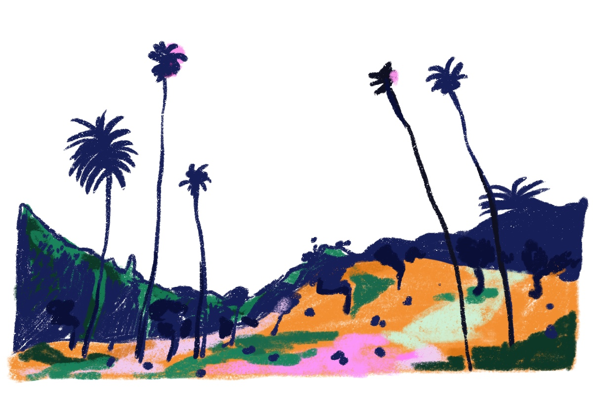
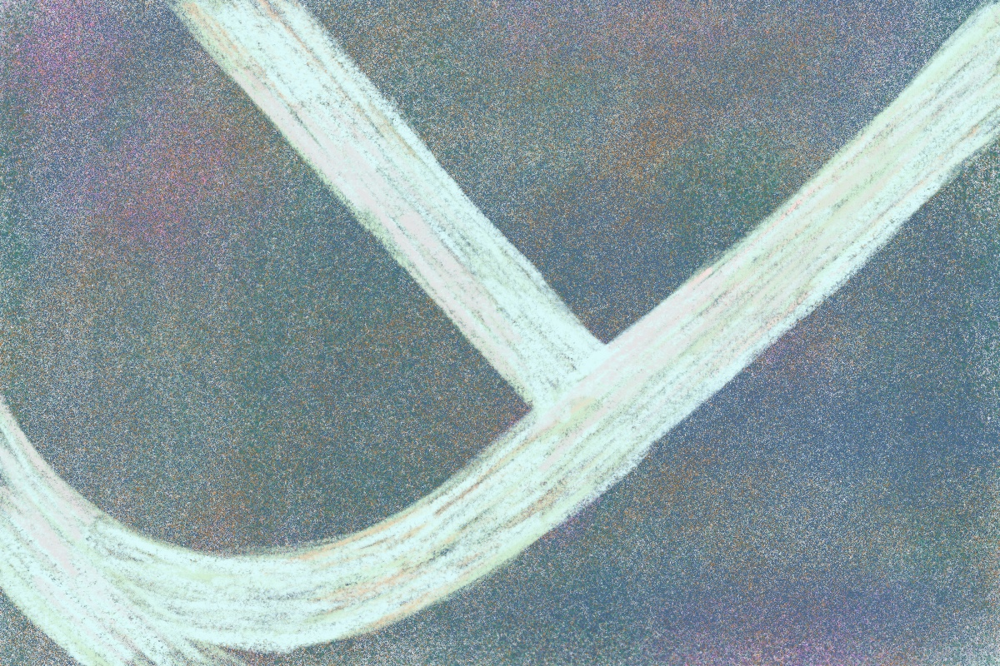
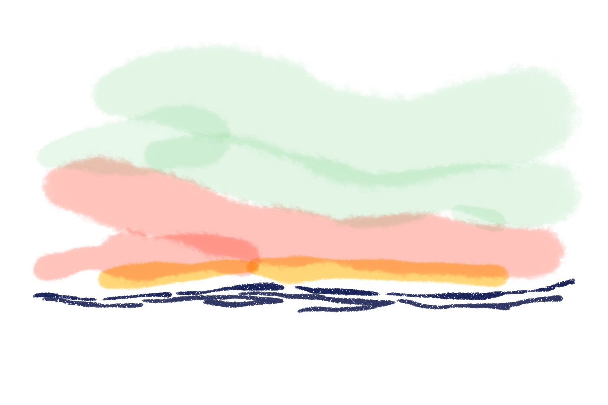
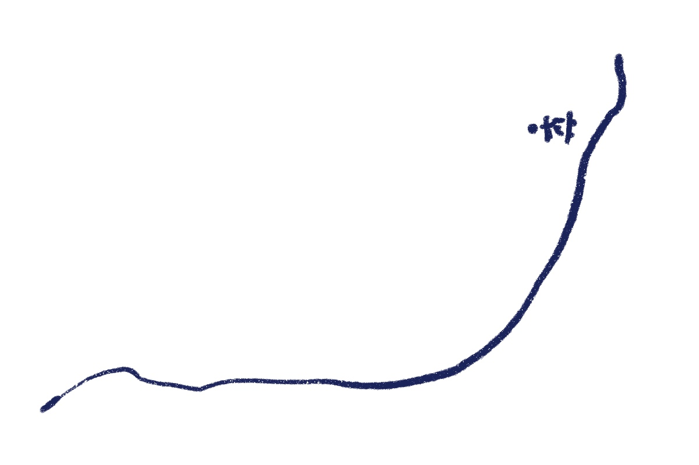
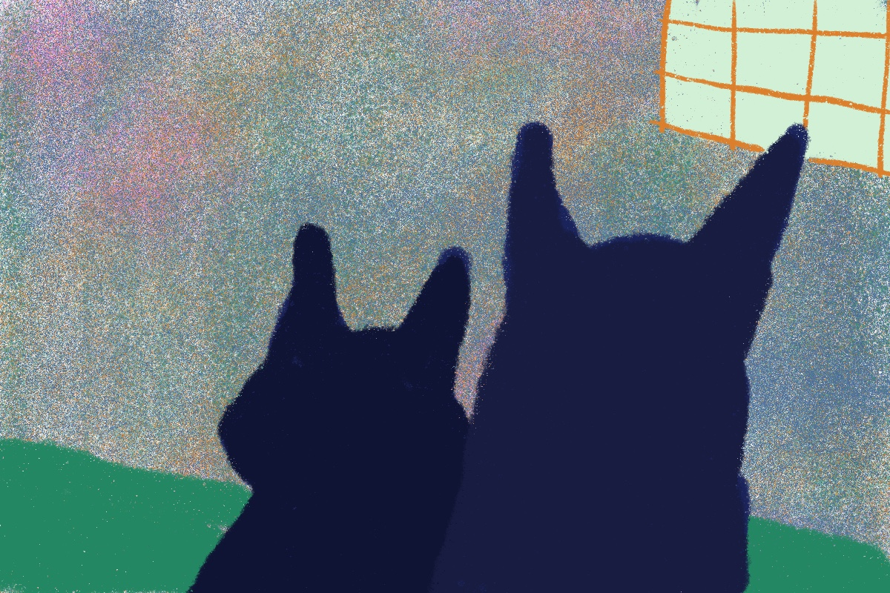

---

title: "shape of the end"
type: "journal"
date: "2020-12-12"
featured_image: "./images/featured.jpg"
image_description: "shape"
published: true

---

For awhile we could not see the shape of end.

For awhile, I was more preoccupied with the shape of towering oak trees in slanted park
horizons, dotted with masked people and dogs (unmasked) from afar.

Hesitantly on my skateboard, I stared down at my feet and noticed the white,
curved strokes painted across the empty basketball court to mark the free-throw line. I stared down until I could feel myself beginning to skateboard.

Up close, I could see people’s eyes but neither their shameless smile nor
their downward frown. From afar, I wondered if there were freckles I could not see.

For awhile, the shape of the “curve” looked like a pacific wave during sunset hour. In the summer, I'd come to the beach and watch the horizon into darkness.

By winter, the "curve" skated upwards into an intimidating 40th-feet-tall skate rink. More people caught the virus. More people died from it. We were warned about this the entire time.

Mostly, I saw the shape of the four corners of my apartment. I'd welcome a hopeful notification buzzing on my phone.

I'd welcome waking up for the 212th morning to two pairs of jagged black ears
in front of me — those belonging to the kittens I adopted during this time.

I miss seeing the shape of a human I adore in similar intimacy.

It’s going to get a bit darker before I can make out the shape of everything I miss returning again. I can finally see it.