---

visible: true
order: 3
title: "Giving people control with content warnings"
subtitle: "Led full-stack product design to protect people from seeing unwanted
content."
date: 2018-08-21
reference: "fb_cw"
source: Facebook
role: Product Design Lead
card_image: "./images/cover_fb_content_warnings.png"
card_image_alt: "content moderation filters"
card_cta: "View Case Study"
featured_image: "./images/cover_fb_content_warnings.png"
featured_image_alt: "content warnings"
type: "work"

---

# In Spring 2017, I designed an entire product to help people deal with unexpected, sensitive content that they encounter on Facebook. Today, Facebook content warnings protect people from seeing things they might not want to see on Facebook.

## Available on all platforms (web, mobile web, iOS, Android), our team's work reduced the amount of negative content reported on Facebook, while improving brand sentiment.

---

## Understanding the problem

### When people go onto Facebook and unexpectedly encounter sensitive content, it is a jarring experience that bothers them.

Today, people report this content to Facebook to get it removed. But Facebook
can’t proactively remove potentially offensive or suggestive content, how can we
offer a remedial experience?

<figure>
  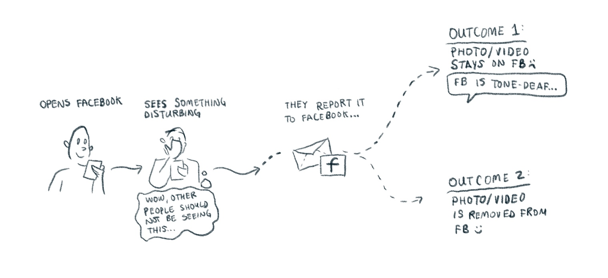
  <figcaption>
    Sometimes, seeing this graphic content without any warnings triggers past
    trauma. Other times, it results in pure embarrassment if they’re browsing
    Facebook in
    public.
  </figcaption>
</figure>

---

## How might we give more control to people over sensitive content that can’t be removed on Facebook?

<figure>
  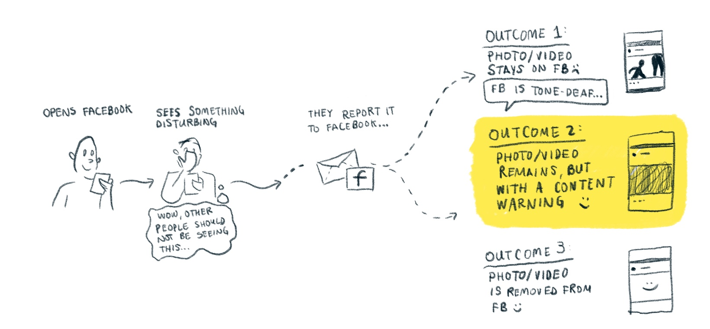
  <figcaption>
  </figcaption>
</figure>

While Facebook's machine-learning technology could detect nudity, pornography,
or sexually suggestive photos and videos, it was less equipped at capturing
graphic violence or hate speech. For the time being, we decided that our content
warning would focus on protecting people from seeing sexually suggestive content
that didn’t violate Facebook’s content policy.

- See and understand why this warning has been applied (understanding that the
  user has turned it on via warning setting)
- Cover content again
- Change their content warning settings
- Tell Facebook that the warning was applied on the wrong type of photo or video
  (e.g. innocuous)
- Tell Facebook that it isn’t enough to conceal this with a content warning — it
  shouldn’t be on Facebook, period. Designing the content warning

---

## Seeing the content warnings

How do we resolve the pain points of the person seeing unwanted content, with
the freedom of expression we grant to person who posted such content in the
first place?

<figure>
  
  <figcaption>
  </figcaption>
</figure>

---

## Empower people with options

Once people reveal the photo or video behind the content warning, how do we
empower them with options they can take? I started with a few directional
exploration flows that look at these requirements.

<figure>
  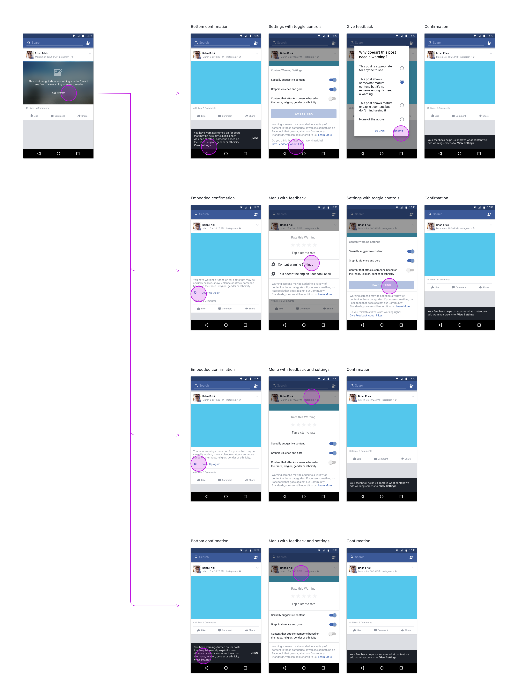
  <figcaption>
    Explorations of what people can do after revealing the photo/video,
    including: covering up the photo/video again, modifying their content warning
    settings, telling Facebook that the warning was applied inaccurately, and
    telling Facebook that this shouldn't be on Facebook at all.
  </figcaption>
</figure>

---

## Controlling how the content warning works

How do we give people control over how “strict” their content warning should be?

<figure>
  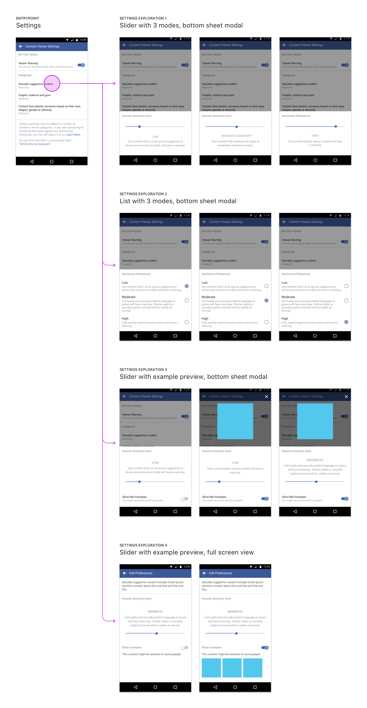
  <figcaption>
    Explorations on how people can control their content warning
  </figcaption>
</figure>

---

Just as my content strategist, UX researcher, and I thought we were “done”
exploring these concepts, a whole new requirement materialized: the CEO urged us
to explore what it looks like if a users’ default setting was determined by
their “community.” This raised a lot of big, open questions for us: how does one
define community?

<figure>
  
  <figcaption>
    Keeping these open questions in our back pocket, we iterated
    on these settings to see how we might
    communicate this notion to users.
  </figcaption>
</figure>

---

## A lasting solution that scales

How would we design and implement an adaptable, modular product experience that
could apply to various “story” formats on Facebook, a product on which numerous
product teams drive their unique product direction (written post, photos,
videos, and other miscellaneous formats)?

<figure>

  <figcaption>
  </figcaption>
</figure>

---

<h1 class="ctr">
  ✍🏼 Our first pass at an end-to-end flow
</h1>

Through multiple cycles of iterations and feedback from my design, product, and
engineering peers, we brought all of the moving parts to create this initial
solution:

<figure>
  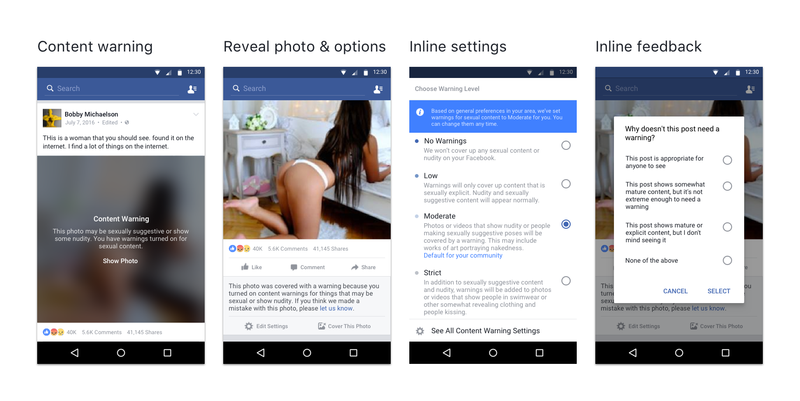
  <figcaption>
  </figcaption>
</figure>

Our end-to-end flow let people:
- see and understand the content warning.
- cover up the photo/video again.
- modify its settings to control how the warning gets applied
- tell Facebook that the warning was applied on the wrong type of photo or video
  (e.g. innocuous)
- tell Facebook that it isn’t enough to conceal this with a content warning — it
  shouldn’t be on Facebook, period.

Given the intense sensitivity, scrutiny, and social & political implications of
my teams’ work, I presented these solutions to our CEO Mark Zuckerberg to get
feedback. I stitched together these screens into an interactive demo to share with Mark.

---

  <iframe src="https://drive.google.com/file/d/1Sx_UJgQAs9mbPwLBHM4H_UV9m3mxMqIo/preview" width="780" height="480"></iframe>

Overall, things looked pretty good. His feedback were to: finesse the content
and copy used on the content warning screen so that it didn’t literally label
this screen as a “Content Warning”, and to iterate on settings so that its
options seemed less judgmental about someone’s personal preferences. 

<figure>
  
</figure>

Rather than use the label “Content Warnings” to describe this cover, we moved
towards using iconography and sublines to present this information. We also
iterated on the settings screen to better communicate their options. 

<figure>
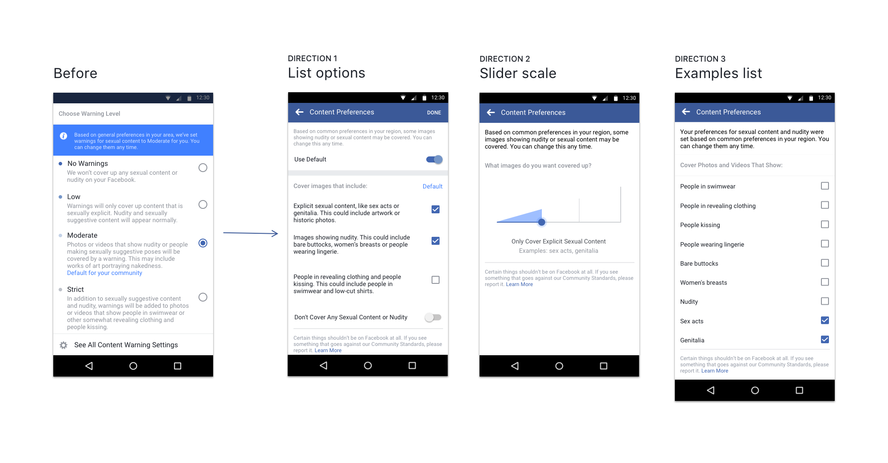
  <figcaption>
  </figcaption>
</figure>

With such distinct directions for these settings, how are we going to figure out
which path to move towards? We needed to step away from our conference rooms and
desks, and begin showing this to real people to get their reactions and
feedback.

---

<h1 class="ctr">
 🌏 Running user research to validate at scale
</h1>

It wasn’t enough to get feedback from Mark Zuckerberg; we needed to make sure
that our solutions would appropriately solve the pain points for our global user
base. That’s why we went to India, Germany, Indonesia, and Mexico to run user
interviews and usability testing.

We wanted to understand:

- What is Facebook's role in handling content described as sexually suggestive,
  hate speech, violence/gore, et cetera? 
- How much do they trust their community's ability to help moderate this content
  on Facebook? 
- Which interaction design patterns best match their expectations when dealing
  with such content?

With three distinct directions of settings to test, not to mention doing it in
five different languages, I ended up creating about 24 different interactive
prototypes using Framer and Invision!

---

<figcaption>
  Preview of my folder organization of the prototypes to illustrate the
  different languages and test options we designed
</figcaption>

Alongside focus groups and conversations with market experts, we used these
three design directions of user settings to understand how they impacted
people’s definition of their “community”. 

<figure>
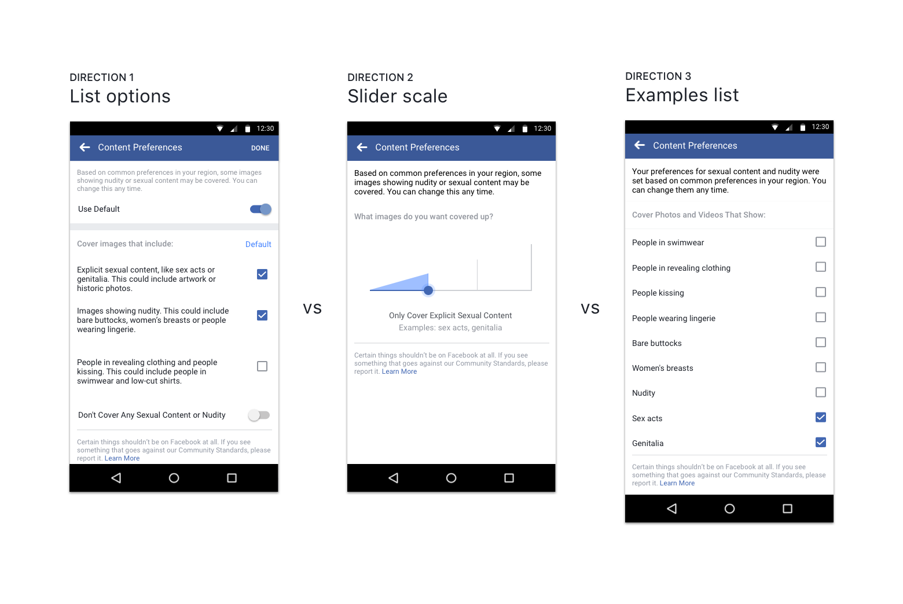
  <figcaption>
  </figcaption>
</figure>

We also wanted sure that our users could understand and use the rest of the flow
— seeing the content warning and being empowered with options after revealing
it.

<figure>
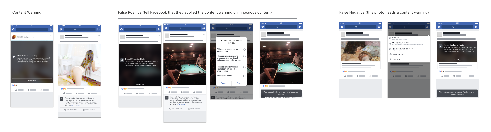
  <figcaption>
    We also had our participants navigate an interactive prototype (above)
    and talk through what they thought the content warnings meant, and what they
    thought would happen if they interacted with it.
  </figcaption>
</figure>

---

After interviews with 200 people in focus groups, one-on-one interviews, market
experts, and usability test sessions, our main insights were:

### “Community” is subjective
“Community” varies and changes meaning during different circumstances. This challenges the business aim to have a “community” define a person’s default setting because a community is pretty… hard to define.

### What’s considered “inappropriate” on Facebook is also subjective.
Not only do people define their "community" subjectively, but so too is what they consider to be flagrant on Facebook. We’d already validated the need for this project; this was further proof that people want more control over what they see or don’t want to see on Facebook.

Other insights from the UX/UI were:

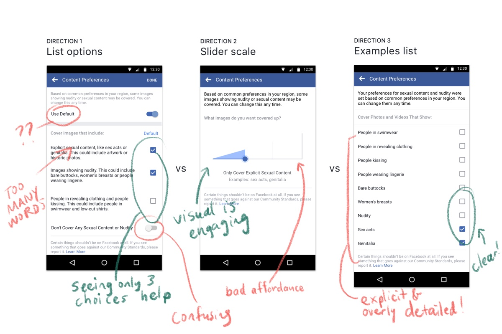

---

<h1 class="ctr">
  ⌛️ Let’s iterate again!
</h1>

With about two weeks left until feature freeze, we used our user research
insights to guide our iteration…

<figure>
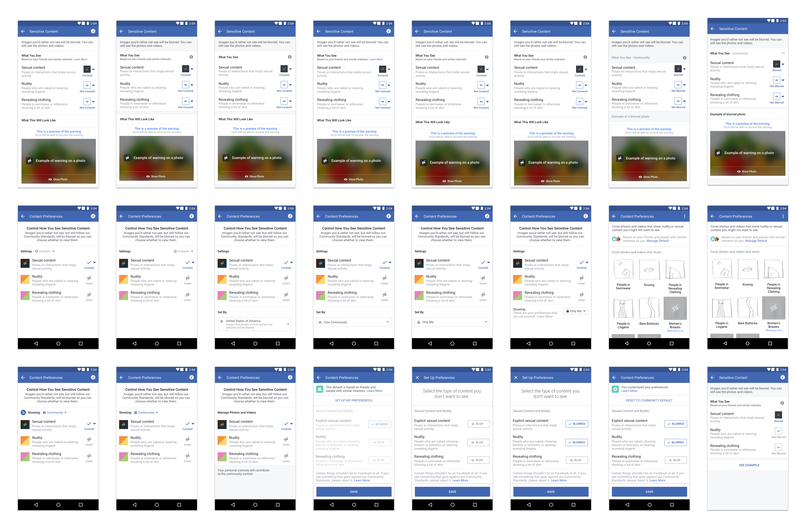
  <figcaption>
    Broad explorations around the visual and interaction language of user
    settings
  </figcaption>
</figure>

Eventually, I narrowed in on a design that’d resolve the pain points we heard in
the user research session. Here’s what the flow looks like here:

<figure>
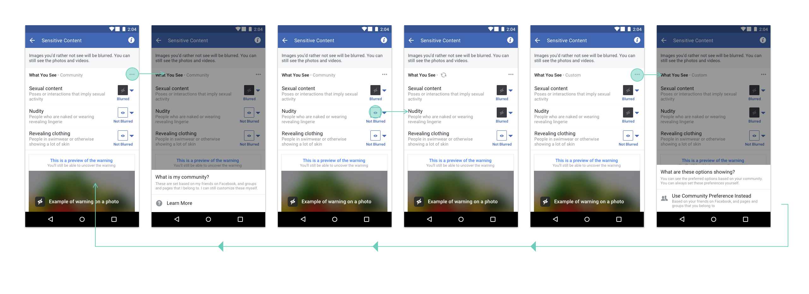
  <figcaption>
  </figcaption>
</figure>

However, it still felt pretty clunky, and the example preview of the seemed
overbearing. With further iterations, I moved the actual example behind an
accessible button, and moved towards using platform toggles to let people toggle
which content to cover or not cover.

At this time, we also moved our language from “blurred/not blurred” to “cover/no
cover” after my content strategist showed this to more people in quick user
testing. Here are our visual design expirations:

<figure>
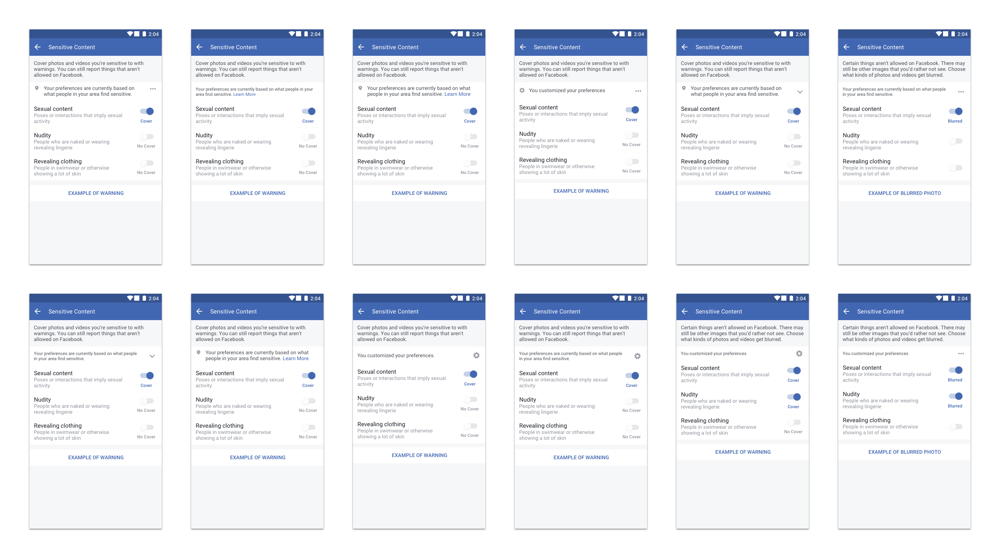
  <figcaption>
  </figcaption>
</figure>

We felt pretty close and narrowed these explorations into three of the strongest
options.

<figure>
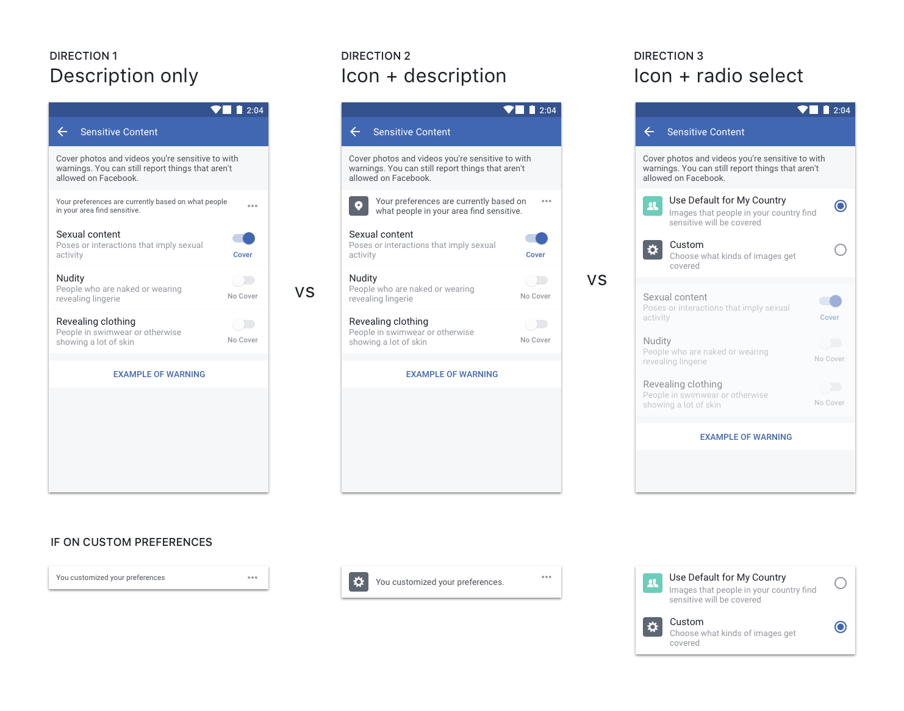
  <figcaption>
  </figcaption>
</figure>

Direction 3 didn’t seem to work as well because it seemed overly prominent, so
we scrapped then. Between Direction 1 and Direction 2, we felt that Direction
2’s inclusion of an icon glyph helps communicate the differences between a
community-based default versus one’s personal preferences, so that’s what we
chose. We ended up with this:

<figure>
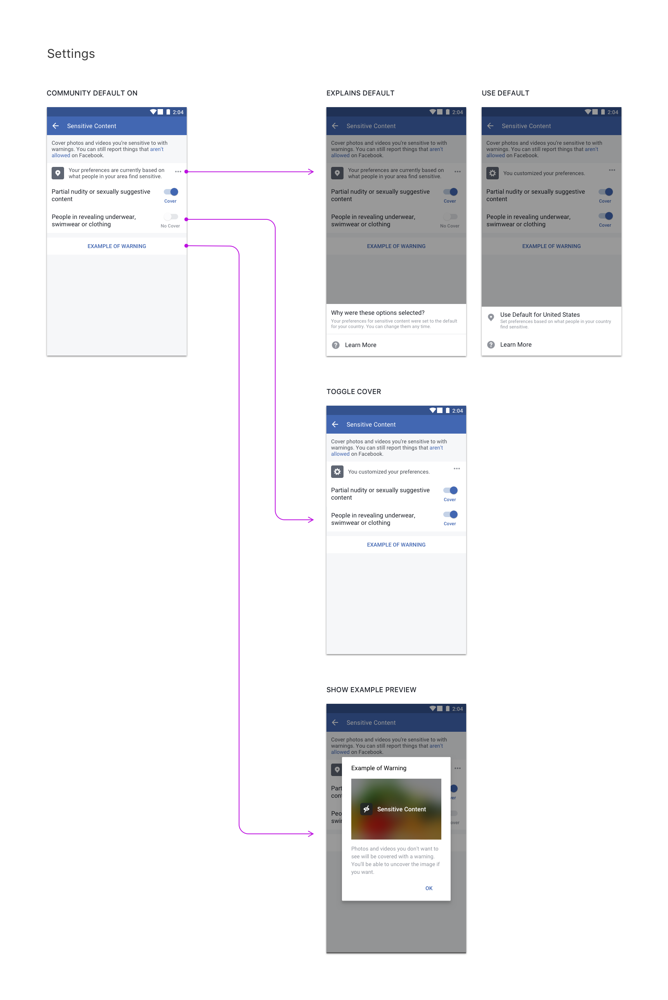
  <figcaption>
  </figcaption>
</figure>

Over the next two weeks, we used these learnings to iterate and polish our MVP.

---

# 🎉 In April 2017, the content warning launched globally on Facebook. It resulted in higher sentiment and decreased reporting of negative content on Facebook.

<figure>

  <figcaption>
    Available on all platforms (web, iOS, Android, mobile web)
  </figcaption>
</figure>

<figure>

  <figcaption>
  </figcaption>
</figure>

