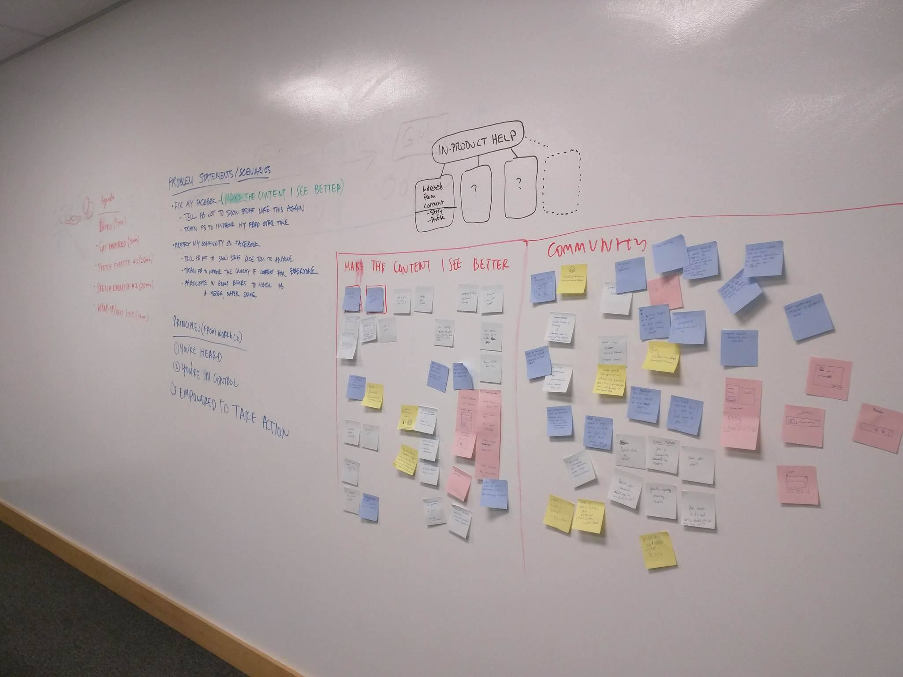
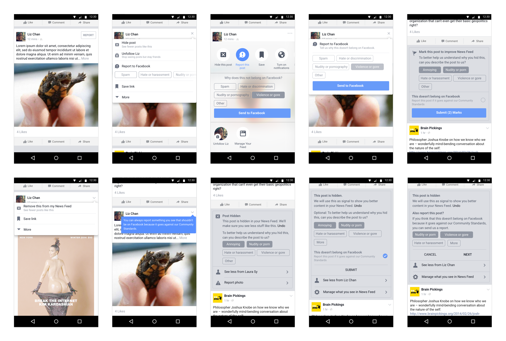
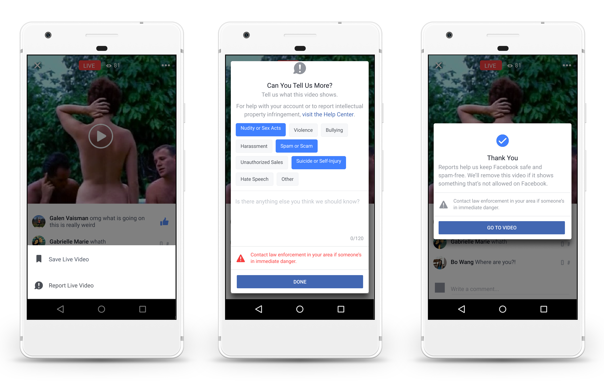

  

    

      In Spring 2016, I led product design to improve Facebook's reporting
      platform so that people can flag inappropriate, sensitive content streaming on
      Live Videos. This allowed Facebook to <strong>intake 574% more reports and
      remove 157% more objectionable content than previously</strong>. This enables
      Facebook to become a safer platform for people to be their authentic selves.
    

  

  

    <h2>
      People are struggling to get their voice heard.
    </h2>
    

      When they see inappropriate content on Facebook, they can report it to get
it removed. However, there were ample problems  with our existing reporting
flow, making it challenging for people to iscover, express their problem, and
find the help they needed.
    

  

  <figure>
    
  </figure>

  

    

      <h2>
        Our users' goals
      </h2>
      

        When people use the reporting flow, they’re trying to accomplish some key
        jobs-to-be-done, including:
      

      <ol>
        <li>
          Protect other people from seeing this on Facebook. (37%)
        </li>
        <li>
          Tell Facebook that I don’t want to see things like this again. (21%)
        </li>
      </ol>
      <cite>Based on a user research survey.</cite>
    

  

  

    

      <h2>
        Sprinting to test our concepts
      </h2>
      

        I reframed these JTBDs as opportunities our team can tackle to help our
  users better accomplish their goals. I kicked it off with a three-week
  full-cycle design sprint to align on these known problems with my team, generate
  ideas, and continuously narrow in on them with validation with real people
  during usability testing.
      

      <ul>
        <li>
          How might we help people protect others from seeing objectionable,
          sensitive content on Facebook?
        </li>
        <li>
          How might we help people tell us that they’re seeing things that they
  don’t like?
        </li>
      </ul>
    

    

      <figure>
        
      </figure>
    

  

  

    <h2>
      Responding to those two prompts, I sketched out an end-to-end user flow concepts that facilitated the jobs-to-be done above. What if reporting leaned into helping people protect their others from seeing inappropriate content, and it was about ease and efficiency?
    </h2>
  

  <figure>
    
    <figcaption>
      Concept wireframe of making reporting one-click
    </figcaption>
  </figure>

  

    <h2>
      ... or what if it was more about empowering the user to tell Facebook what
      they like or didn't like seeing?
    </h2>
  

  <figure>
    
    <figcaption>
      Concept wireframe of people needing to hide a post first before reporting
      it
    </figcaption>
  </figure>

  

    

      I brought these flows into higher fidelity explorations and began looking
at different ways people can access this flow...
    

  

  <figure>
    
  </figure>

  

    

      I worked in process, zooming in and out of my explorations to discover,
then narrow in, on the optimal solutions that the team and I had the most
confidence in. These are explorations of user flows:
    

  

  <figure>
    
  </figure>

  

    

      By the middle of week two, I had narrow possible concepts to two
directional prototypes I’d made in Framer:
    

  

  

    <iframe src="https://drive.google.com/file/d/1_8eqJi-zFC8AkcuzF0KFhCiBHGFzNDT3/preview" width="780" height="480"></iframe>
    <figcaption>
      1. Concept demo of one-click reporting
    </figcaption>
  

  

    <iframe src="https://drive.google.com/file/d/1AEJVOwHrgHiNMnRYcQcWYapli5VzcQgl/preview" width="780" height="480"></iframe>
    <figcaption>
      2. Concept demo of hiding, then reporting
    </figcaption>
  

  

    <h2>What we learned from user research</h2>
    

      When we brought these two concepts into usability testing with seven
participants, we found that people preferred the one-click reporting concept to
the other one. This informed us that:
    

    <ul>
      <li>
      People intend to “report” or to “hide” something for different reasons,
and it’s going to be rather personal.
      </li>
      <li>
        With the multiple tags UI components, people felt more empowered to tell
us with greater nuance about their issues.
      </li>
    </ul>
    

      These learnings gave us confidence moving ahead to ship this new reporting
flow on Facebook.
      

  

  

    <h2>Results and outcomes</h2>
    

      We used these learnings to launch this reporting flow two months later for
Live Videos, before expanding it to be application beyond all media content on
Facebook, like normal videos, photos, and posts.
    

    

      This allowed Facebook to <strong>intake 574% more reports and
      remove 157% more objectionable content than previously</strong>.
    

  

  <figure>
    
    <figcaption class="text_align--center">
      We launched this flow on Android, iOS, desktop, and mobile web.
    </figcaption>
  </figure>

  

  

    

      More detailed case study available upon request.
    

  

