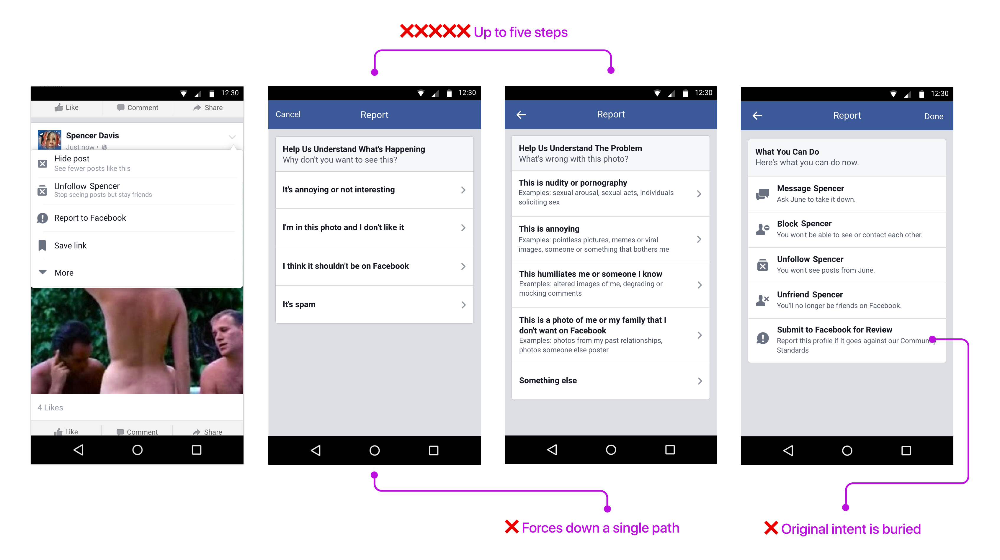
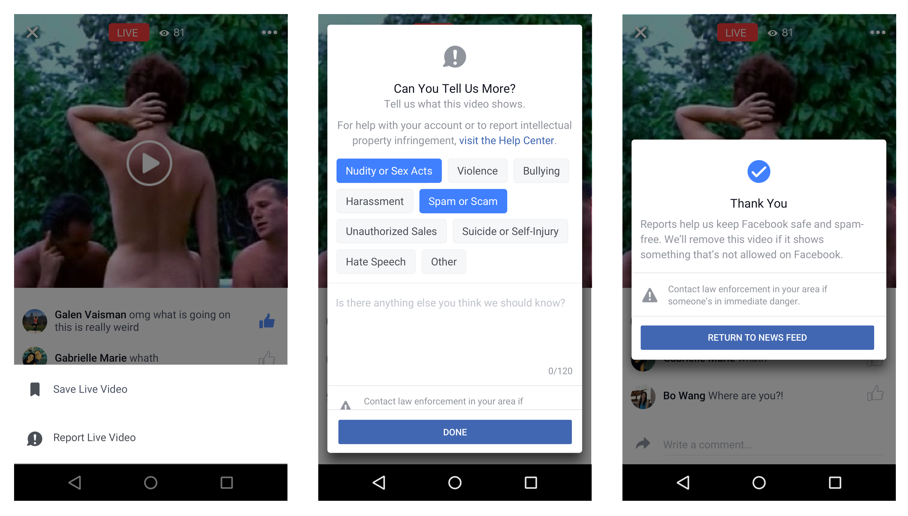

---

visible: true
order: 2
title: "Redesigning a content reporting platform"
subtitle: "Designed and launched the reporting flow on Facebook's Live Videos globally on all platforms, ensuring that people can report any violating content they see."
date: 2018-08-21
reference: "fb_live_reporting"
source: Facebook
external_url: "https://paper.dropbox.com/doc/Facebook-Redesigning-a-reporting-platform--Ae4I~VHteU5fcck28RyngoQPAQ-UQK1O2vSnEx8SGuHsBxtI"
duration: "2016"
role: Product Design Lead
card_image: "./images/card_img-2.png"
card_image_alt: "content moderation filters"
featured_image: "./images/header_bg.png"
featured_image_alt: "content moderation filters"
type: "work"

---

  

    <h2>tl;dr</h2>
    

      In Spring 2016, I led product design to ship a reporting platform for Live
Videos so that people can be more empowered to tell Facebook about
objectionable, sensitive content streaming on Live Videos. My work culminated
from multiple cycles of research, understanding, and iterative experiments; the
new flow allowed Facebook to <strong>intake 574% more reports and remove XX% more
objectionable content than previously</strong>. This enables Facebook to become a safer
platform for people to be their authentic selves.
    

  

  

    <figure>
      
    </figure>
  

  

    <h2>
      What was wrong with the existing reporting flow?
    </h2>
    

      There were lots of known issues with our existing reporting flow
      that made it challenging for people to iscover, express their problem,
      and find the help they needed.
    

  

  <figure>
    
  </figure>

  

    <h2>
      Our users' goals
    </h2>
    

      When people use the reporting flow, they’re trying to accomplish some key
jobs-to-be-done, including:
    

    <ul>
      <li>
        Protect other people from seeing this on Facebook.
      </li>
      <li>
        Tell Facebook that I don’t want to see things like this again.
      </li>
    </ul>
  

  

    <h2>
      Outcomes
    </h2>
    

      The Live Video reporting flow was more effective in flagging flagrant
      content than the existing reporting flow. When we A/B launched the two
      flows, we found that the new reporting flow captured:
    

    

      <ul class="styled">
        <li>
          1.5x more policy-violating Live broadcasts.
        </li>
        <li>
          7.5x more distinct people reporting Live
          broadcasts.
        </li>
        <li>
          5.75x more distinct Live broadcasts reviewable by our Community
          Operations team.
        </li>
      </ul>
    

  

  

    <figure>
      
    </figure>
  

  

    <h2>
      Recap
    </h2>
    

      This project was exciting and allowed our team to move fast with the validation we had already heard from our data and user research. I approached the project with these principles in mind:
    

    

      <ul class="styled">
        <li>
          <strong>
            Collaboration
          </strong>
           
          Drove end-to-end design and development across multiple internal
          organizations (Product, Policy, Communications, Community Operations)
           with colleagues in Menlo Park, Seattle, and London.
        </li>
        <li>
          <strong>
            Agile
          </strong>
           
          Coordinated agilely with core Live Videos team to develop a
          consistent product experience in tandem with each other.
        </li>
        <li>
          <strong>
            Extensibility
          </strong>
           
          Developed an extensible product framework applicable to varying
          severity of reporting use cases, ranging from most "minor" (nudity or
          sex acts) to most critical (suicide and self-injury).
        </li>
      </ul>
    

  

